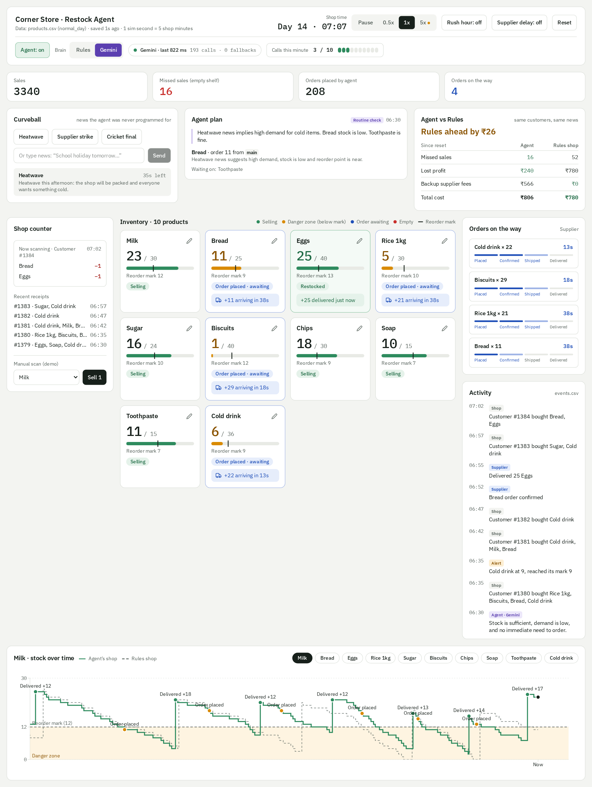

# Agentic AI

Hands-on agentic AI projects. Each folder is a self-contained project with its own README.

| Folder | What it is |
|---|---|
| [autonomous_agents](autonomous_agents/) | **Restock Agent Demo**: a simulated corner shop where an agent (fixed rules or Gemini on Vertex AI) watches stock, reorders from suppliers and reacts to news. FastAPI backend, React dashboard. Guides: [What it does](https://navin251285.github.io/agentic_ai/autonomous_agents/docs/what-it-does.html) · [Architecture](https://navin251285.github.io/agentic_ai/autonomous_agents/docs/architecture.html) |
| [langgraph-calculator-tutorial](langgraph-calculator-tutorial/) | **LangGraph calculator tutorial** (in progress): a beginner course that teaches LangGraph one idea per notebook, using a calculator that grows lesson by lesson. Mostly offline; Gemini appears only in the last few lessons. |
| [vector-database-core](vector-database-core/) | **Vector databases tutorial** (in progress): builds vector search from scratch with NumPy, then moves to Qdrant: collections, payloads, filters, batch ingestion, search evaluation, chunking and choosing embedding models. Runs offline; no API key needed. |



## Getting started

```bash
git clone https://github.com/navin251285/agentic_ai.git
cd agentic_ai/autonomous_agents
```

Then follow [Getting started (new users)](autonomous_agents/README.md#getting-started-new-users) in that project's
README: it covers creating your own API key and `.env` file, installing, and running.

## Secrets

No keys, passwords or cloud project IDs are stored in this repository. Each user creates their own `.env` from the
project's instructions; `.env` files are git-ignored. If you contribute, check `git status` before every commit and
never add a `.env` or credentials file.
